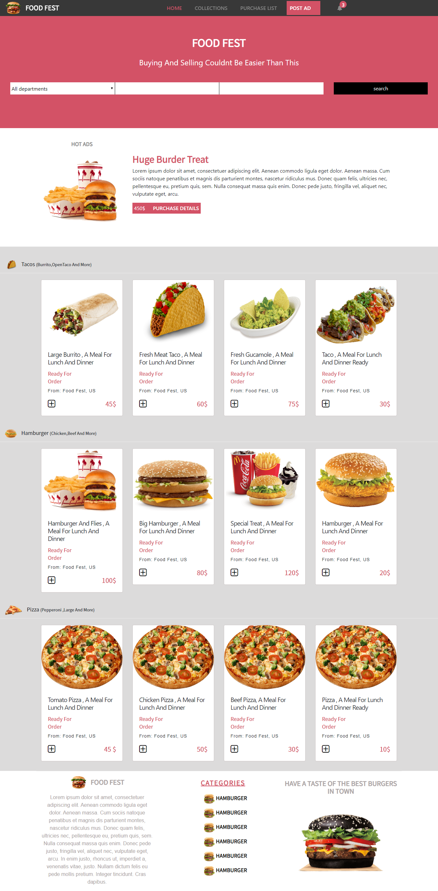
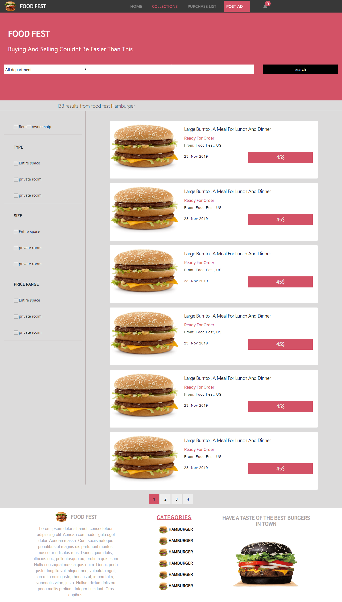

# Food Fest

> This is the HTML and CSS capstone project the objective is to create a website for an e-commerce platform. Using only the conceptual design to build the site takes care of user experience and UI design.

> In my case I decided to design my website for a fantasy fast food e-commerce platform
> I have developed this website with basic HTML CSS but am in the process of converting it to a WordPress site

## Link to the conceptual design by Mohammed Awad

[ conceptual design ](https://www.behance.net/gallery/24796463/ZATTIX)

## Presentation Video Link

[ Presentation Video Link ](https://www.loom.com/share/2ab6561f7c064d2d8365d817883a611b)

# The requirements of this project are:

### Design

- The main page with link to the search results page.
- The search page.

### Resolution

- Mobile upto 768px
- Desktop from 768px

### Guidelines design

- colors
- typographies: font face , size  and weight
- layout: Compositionand space between elements, for the 2 given screen sizes.

# HomePage

- The homePage has the basic information of the ecommerce platform. This consist products that the food store sells.

# SearchPage

- The SearchPage has the basic information of the ecommerce platform. This consist the results of search functionality that happens on the homepage.

Additional description about the project and its features.

## Built With

- HTML and CSS,
- bootstrap 4,
- Font-Awesome library,
- Javascript

## Live Demo

[Live Demo Link](https://rawcdn.githack.com/peterrobert/food-fest/dfd4a3e1f6033b128d31db5e3a2ff3691c94522b/index.html)

## Getting Started

To get a local copy up and running follow these simple example steps.

### Prerequisites

browser and a code editor.

### Setup

clone the repository to your machine, navigate into the folder and open the index.html document using your favotite browser

### Usage

you can open the code in your favorite code editor and make changes as you wish

### Deployment

Just deploy the files to a server

## Authors

👤 **Peter Robert Ndungu**

- Github: [@peterrobert](https://github.com/peterrobert)
- Twitter: [@pwambui93](https://twitter.com/Ptahwambui93)
- Linkedin: [peter robert Ndungu](https://www.linkedin.com/in/peter-rob-ndungu/)

## 🤝 Contributing

Contributions, issues and feature requests are welcome!

## Show your support

Give a ⭐️ if you like this project!

## Acknowledgments

- Hat tip to anyone whose code was used
- Design idea by Mohammed Awad on Behance

## 📝 License

This project is [MIT](lic.url) licensed.
